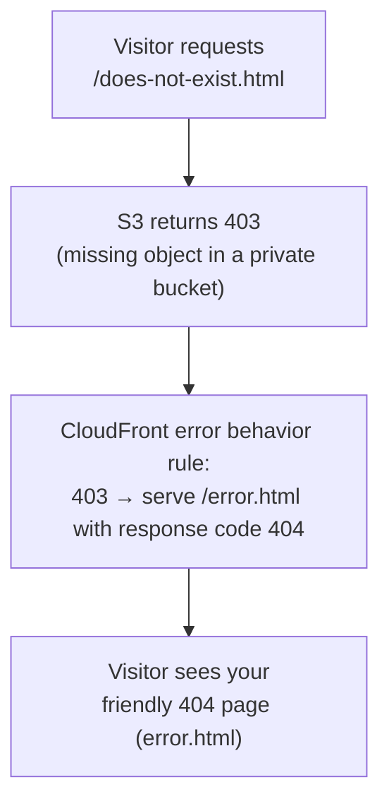
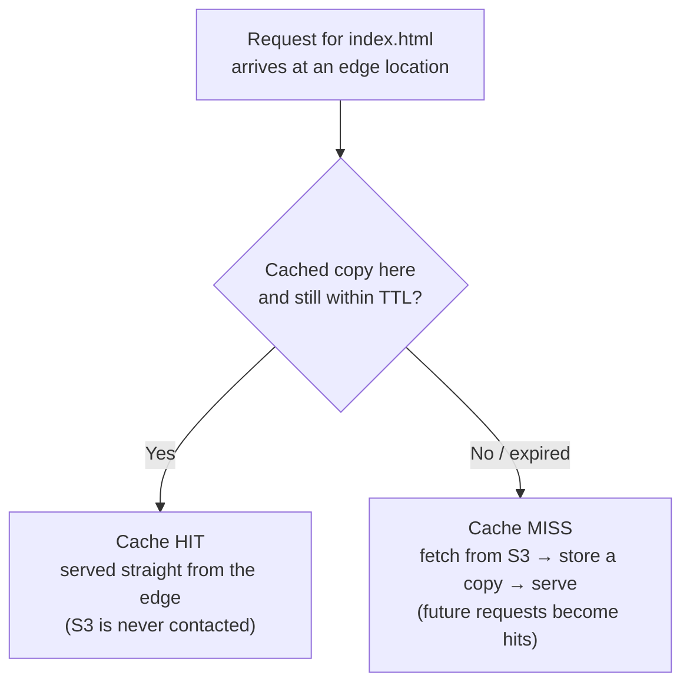

# Step 4 — Error Pages, Caching, and Cache Invalidation

Your site works. Now you'll make it behave like a real website: show a friendly page when
something is missing, and understand how CloudFront caches your files (and how to push
updates).

---

## 4.1 Concept — Error Behavior (Custom Error Responses)

When a visitor requests a file that doesn't exist, S3 returns an error. Because your bucket
is **private with OAC**, S3 returns **403 Forbidden** for a missing object (not the 404
you might expect — S3 won't reveal whether the object exists to an unauthorized-looking
request). By default CloudFront passes that raw error straight to the visitor.

A **custom error response** lets you intercept that error code and instead return your own
page with a chosen status code:



---

## 4.2 Console — Add Custom Error Responses

1. Open **CloudFront** → click your distribution → **Error pages** tab.
2. Click **Create custom error response**.
3. Fill in for **403**:

   | Field | Value |
   |-------|-------|
   | HTTP error code | **403: Forbidden** |
   | Customize error response | **Yes** |
   | Response page path | `/error.html` |
   | HTTP Response code | **404: Not Found** |

4. Click **Create custom error response**.
5. Click **Create custom error response** again and repeat for **404**:

   | Field | Value |
   |-------|-------|
   | HTTP error code | **404: Not Found** |
   | Customize error response | **Yes** |
   | Response page path | `/error.html` |
   | HTTP Response code | **404: Not Found** |

> We map **both 403 and 404** to `/error.html`. The 403 mapping is the important one for a
> private-bucket setup; the 404 mapping covers any case where S3 does return a true 404.

6. Wait for the distribution to redeploy (a few minutes), then test:

   ```bash
   curl -i https://d111abc123xyz.cloudfront.net/nope.html
   ```

   You should get your `error.html` content with `HTTP/2 404`.

---

## 4.3 Concept — Caching and TTL

CloudFront's whole job is to **cache** your files at edge locations so visitors are served
quickly and S3 isn't hit on every request.

- The first request for `index.html` is a **cache miss**: CloudFront fetches it from S3,
  returns it, and stores a copy at that edge location.
- Later requests are **cache hits**: served straight from the edge, never touching S3.
- How long a copy is kept is the **TTL** (Time To Live), set by the cache policy
  (`CachingOptimized` defaults to about 24 hours).



You can confirm a hit vs miss from the response header:

```bash
curl -I https://d111abc123xyz.cloudfront.net/ | grep -i x-cache
# x-cache: Miss from cloudfront   ← first request
# x-cache: Hit from cloudfront    ← subsequent requests
```

---

## 4.4 Concept + Action — Cache Invalidation

Here's the catch with caching: if you edit `index.html`, re-upload it to S3, and refresh
your browser, you'll **still see the old page** — because CloudFront is serving the cached
copy until its TTL expires (up to 24 hours).

A **cache invalidation** tells CloudFront to immediately drop cached copies of the paths
you specify, so the next request fetches the fresh file from S3.

**Try it:**

1. Edit `src/index.html` (change the heading text), then re-upload it to S3
   (Step 2 again, or `aws s3 cp`).
2. Refresh the CloudFront URL — you still see the old text (cached).
3. In **CloudFront** → your distribution → **Invalidations** tab → **Create invalidation**.
4. Under **Add object paths**, enter:
   ```
   /*
   ```
   (`/*` invalidates everything. You could also invalidate just `/index.html`.)
5. Click **Create invalidation**. It completes in a few seconds to a minute.
6. Refresh the CloudFront URL — your updated page now appears.

> **Cost note:** the first **1,000 invalidation paths per month are free**. `/*` counts as
> a single path. After that, it's $0.005 per path. For learning, you'll never hit the limit.
>
> **Best practice:** instead of invalidating on every deploy, production sites often change
> the file name when content changes (e.g. `app.a1b2c3.js`) so the URL itself is new and no
> invalidation is needed. For simple HTML sites, `/*` invalidation is perfectly fine.

### AWS CLI (Alternative)

```bash
aws cloudfront create-invalidation \
  --distribution-id DISTRIBUTION_ID \
  --paths "/*"
```

---

## Checkpoint

- [ ] Custom error responses map **403 → /error.html (404)** and **404 → /error.html (404)**
- [ ] Requesting a non-existent path shows your `error.html`
- [ ] You understand cache **Hit** vs **Miss** from the `x-cache` header
- [ ] You edited a file, re-uploaded it, and used an **invalidation** to make the change live

---

**Next:** [Step 5 — Clean Up All Resources](./05-cleanup.md)
